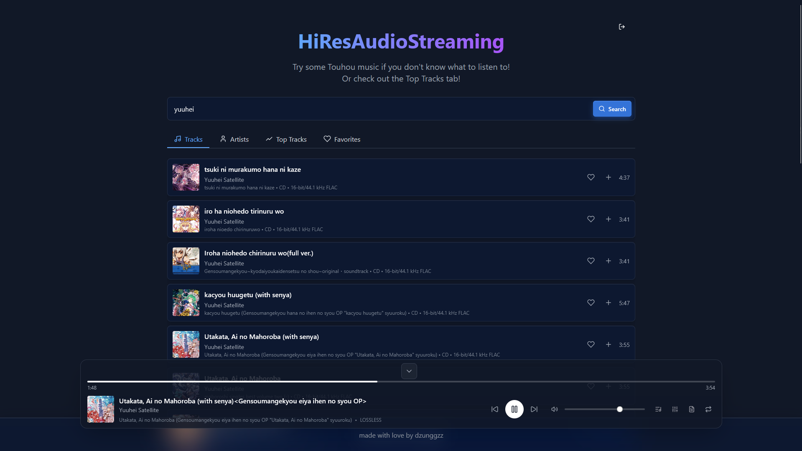

# *Sản Phẩm Cuối Khoá Web Development Intensive*

*HRAS* là dự án nhằm mang lại trải nghiệm âm nhạc tuyệt vời tại gia. *HRAS* sử dụng API HIFI của [sachinsenal0x64](https://github.com/sachinsenal0x64/hifi), TailwindCSS cho phần UI (cảm ơn [uimaxbai](https://github.com/uimaxbai/tidal-ui)) và Parametric EQ của [teropa và samueldiggins](https://github.com/teropa/weq8).

Chất lượng âm thanh: CD-quality (16-bit, 44.1kHz) LOSSLESS FLAC.

> [!CAUTION]
> Dự án này được tạo ra với mục đích giáo dục, chúng tôi không ủng hộ việc nghe / tải lậu âm nhạc.

> [!TIP]
> Nếu bạn không biết nghe bài nào, hãy nghe thử mấy bài Touhou Vocal. 

Changelog (as of 8th Jan. 2026):
- [x] Implemented Album search
- [x] Revamped UI/UX
- [x] Revamped Artist search, a dedicated page for Artist's details has been created
- [x] Revamped My Playlists, there's also a dedicated page for it
- [x] Revamped Lyrics (W uimaxbai) 
- [x] Forgot Password functionalities
- [x] Removed Top tracks tab
- [x] Added Remove Track from Playlist functionality
- [x] Search History, Keyboard Shortcuts, it should be less annoying when switching search modes now.

Changelog - 10th Jan. 2026:
- [x] New Login/Register UI (was using an UI from one of my OLDDDDDD projects)
- [x] Settings Panel
- [x] New Keyboard Shortcuts, check them out in the Settings Panel

Issues: ~~Track and Artist search functions are broken, no fix lol~~

