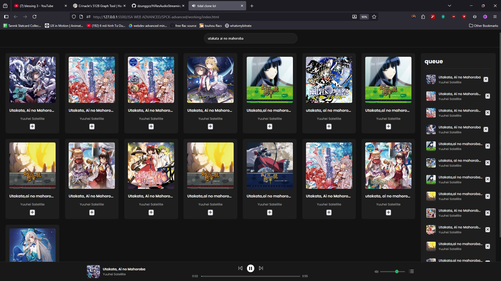

# *Sản Phẩm Cuối Khoá Web Development Intensive*

*HRAS* là dự án nhằm mang lại trải nghiệm âm nhạc tuyệt vời tại gia. *HRAS* sử dụng API HIFI của [sachinsenal0x64](https://github.com/sachinsenal0x64/hifi), TailwindCSS cho phần UI (cảm ơn [uimaxbai](https://github.com/uimaxbai/tidal-ui)) và Parametric EQ của [teropa và samueldiggins](https://github.com/teropa/weq8).

Chất lượng âm thanh: CD-quality (16-bit, 44.1kHz) LOSSLESS FLAC.

> [!CAUTION]
> Dự án này được tạo ra với mục đích giáo dục, chúng tôi không ủng hộ việc nghe / tải lậu âm nhạc.

> [!TIP]
> Nếu bạn không biết nghe bài nào, hãy nghe thử mấy bài Touhou Vocal.

Màn hình chính:

Chế độ Fullscreen:

Màn hình chính trên điện thoại (Iphone 14 Pro Max viewport):

Chế độ Fullscreen trên điện thoại (Iphone 14 Pro Max viewport):

Lời nhạc trên điện thoại (Iphone 14 Pro Max viewport):

